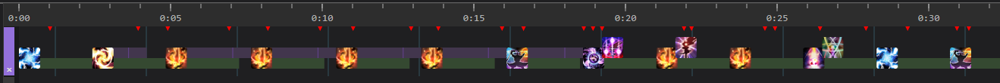
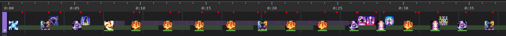

# DSR

828 sps blm

## Thordan 1

### Opener

- prepull pot instead

### Post-Strength

- transpose on tower soak

### Post-Sanctity

- sharpcast at ice puddle right before sharpcast caps
- leyline at 5s on sharpcast
- if f3p, save for nidhogg

## Nidhogg

### Opener

- transpose only if f3p from thordan

### Branching Wyrmhole

- top line if 1s and rear
- bottom line otherwise

### Converge

- pot when up to skip drachenlance

## Eyes

- todo: testing alternatives, to be replaced

## Haurchefant

- must get ui3 after spear
  - if ice paradox used, must get 3 umbral hearts also

## Thordan 2

### Opener

- yolo scathe at the end, doing one more gcd is ghosty
- don't forget to refill paradox
- todo: use paradox instead of xeno (get an extra one for two minute window later)

### Post-Wrath

- don't forget to refill paradox again
- no caster lb2 on meteors (for our group)
- todo: rework for extra xeno

### Post-Death

- yolo, but hold resources
  - sharpcast during doth at some point to get thundercloud for double dragons
  - manaward for playstation

## Double Dragons

don't know how the two plans in the blm dsr channel fare

- caster lb3 but when will it happen???
  - caster lb3 is 4.5s cast with ~8s anilock (healer rescue lets you move but gcd still locked)
  - transpose into ui1 from af3, caster lb3, ice paradox to refresh

## Dragon King

don't know how the single plan in the blm dsr channel fares
