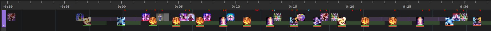
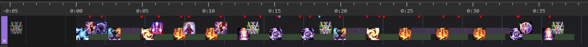
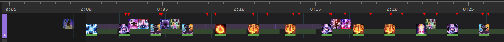
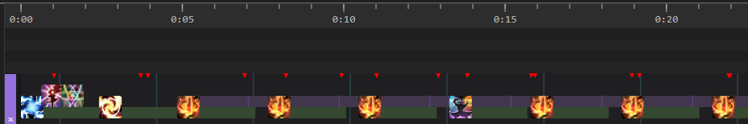
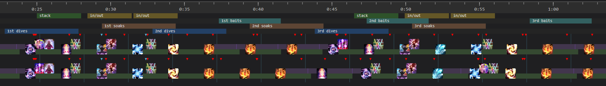
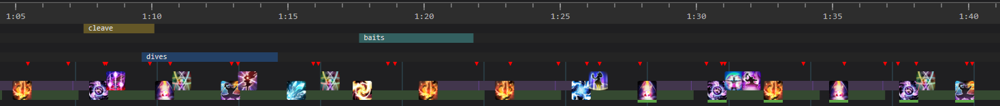
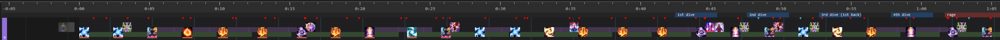
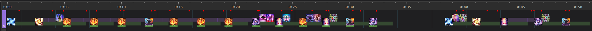

# DSR

828 sps blm

## Thordan 1

### Opener

### Post-Strength

- transpose on tower soak

### Post-Sanctity

- sharpcast at ice puddle right before sharpcast caps
- leyline at 5s on sharpcast
- if f3p, save for nidhogg

## Nidhogg

*untested, only works in theory*

### Opener

- transpose only if f3p from thordan

### Branching Wyrmhole

- top line if 1s or 2s with circle
- bottom line if 3s or 2s with arrow

### Converge

- pot held for eyes

## Eyes

- pot as the orbs reach the eye spots

## Haurchefant

- must get ui3 after spear
  - if ice paradox used, must get 3 umbral hearts also

## Thordan 2

eydis plan (also kinda works)

- no caster lb2 on meteors (for our group)

## Double Dragons

don't know how the two plans in the blm dsr channel fare

- caster lb3 but when will it happen???
  - caster lb3 is 4.5s cast with ~8s anilock (healer rescue lets you move but gcd still locked)
  - transpose into ui1 from af3, caster lb3, ice paradox to refresh

## Dragon King

don't know how the single plan in the blm dsr channel fare
